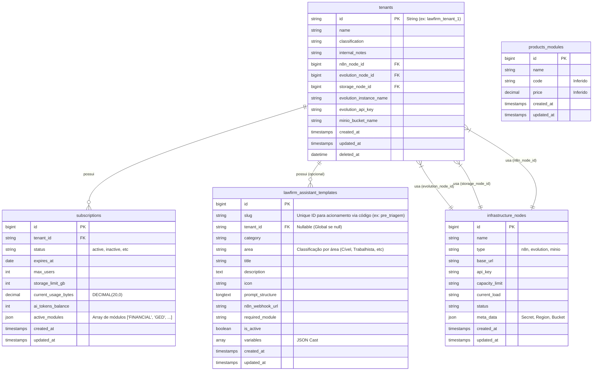

# Mothership Database Architecture (SaaS)

Este documento descreve a estrutura do banco de dados externo `mothership`, responsável pelo gerenciamento Multi-Tenant da aplicação LawFirm.

**Status:** Schema inferido via Engenharia Reversa do pacote `SuiteZap\LawFirm` (Fev/2026).

## Visão Geral

O banco de dados `mothership` é segregado do banco de dados da aplicação (`mysql`). Ele armazena informações globais de infraestrutura, cobrança e configuração de tenants.

*   **Conexão Laravel:** `protected $connection = 'mothership';`
*   **Service Principal:** `SuiteZap\LawFirm\SaaS\Services\MotherShipService`

## Diagrama ER (Inferido)

## Dicionário de Dados

### 1. Tenants (`tenants`)
Armazena a identidade do cliente SaaS e suas conexões de infraestrutura.
*   **PK:** `id` (String). Não é auto-incremento.
*   **Relacionamentos:**
    *   `subscription`: HasOne.
    *   `evolutionNode`, `storageNode`, `n8nNode`: BelongsTo `infrastructure_nodes`.

### 2. Subscriptions (`subscriptions`)
Controla o plano, limites e consumo do cliente.
*   **Armazenamento:** `current_usage_bytes` é `DECIMAL(20,0)` para suportar tamanhos exatos de storage.
*   **Módulos:** `active_modules` é um array JSON que ativa features no frontend (ex: Financial, GED, AI).

### 3. Infrastructure Nodes (`infrastructure_nodes`)
Catálogo de recursos compartilhados (Servidores de API, Buckets S3).
*   **Types:**
    *   `n8n`: Servidores de automação.
    *   `evolution`: Servidores de WhatsApp API.
    *   `minio`: Buckets S3/MinIO para armazenamento de arquivos.
*   **Meta Data:** Armazena segredos específicos (Secret Key do S3, Region) em JSON.

### 4. Assistant Templates (`lawfirm_assistant_templates`)
Modelos de prompt para a IA.
*   **Escopo:** Se `tenant_id` for NULL, o template é **Global** (visível para todos). Caso contrário, é exclusivo do tenant.
*   **Integração:** Pode disparar webhooks do N8N (`n8n_webhook_url`).
*   **Relação Cross-Database (Histórico):** A tabela de histórico de execuções (`lawfirm_assistant_history`) reside no **banco de dados do Tenant** (pois contém os dados sensíveis gerados e vinculações ao `lead_id`), mas mantém uma chave estrangeira lógica (`template_id`) apontando para esta tabela no Mothership. Consultas como o `AssistantHistoryDataGrid` realizam o *mapping* (via Eloquent no backend) para obter o nome do template sem fazer um JOIN SQL cross-database direto.

## Notas de Implementação

1.  **Storage Dinâmico:** O Laravel não tem o disco `s3` configurado no `.env` para produção. Ele é injetado em tempo de execução (`config(['filesystems.disks.s3' => ...])`) pelo `MotherShipService::configureTenantStorage()`, usando dados de `infrastructure_nodes`.
2.  **Redirects:** URLs de `evolution_api` e `n8n` são recuperadas dinamicamente para evitar hardcoding de servidores.
