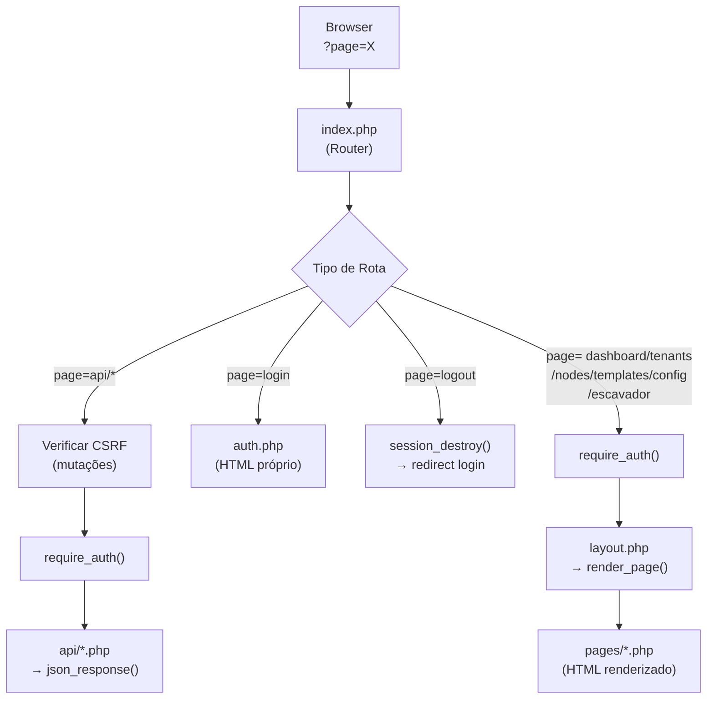

# MotherShip Panel — Arquitetura da Aplicação

Este documento descreve a estrutura da aplicação **MotherShip Panel**, um painel administrativo PHP puro para gerenciamento Multi-Tenant do ecossistema LawFirm SaaS.

**Status:** Documentado via leitura direta do código-fonte (Mar/2026).
**Referência de Banco:** Ver `ARCHITECTURE_mothership_db.md`.

---

## 1. Visão Geral

O MotherShip Panel é uma aplicação web PHP nativa (sem framework), com um único ponto de entrada (`index.php`) que roteia requisições para páginas e endpoints de API internos. Seu propósito é ser a **interface de administração centralizada** para:

- Gerenciar tenants e suas assinaturas.
- Provisionar e monitorar nós de infraestrutura (Evolution, N8N, MinIO).
- Administrar templates globais de IA para todos os tenants.

---

## 2. Estrutura de Arquivos

```text
mothership/
├── index.php                  # Single Entry Point — Roteador principal
├── config.php                 # Constantes globais (DB, Auth, App, Módulos)
├── auth.php                   # Página de login (HTML completo + lógica)
│
├── includes/
│   ├── db.php                 # Singleton PDO + helpers (db_query, db_row, db_execute)
│   ├── functions.php          # Funções utilitárias (CSRF, flash, format, url, auth)
│   └── layout.php             # HTML Shell + Sidebar + JS global (objeto MS)
│
├── pages/                     # Páginas renderizadas dentro do layout
│   ├── dashboard.php          # Cards de Tenants + Stats + Modais JS
│   ├── tenants.php            # Listagem e criação de tenants
│   ├── nodes.php              # CRUD de nós de infraestrutura (create/edit/delete)
│   ├── templates.php          # Listagem + edição + toggle de Templates de IA
│   ├── config.php             # Gerenciamento de app_config
│   └── escavador.php          # Gestão de preços do Escavador
│
├── api/                       # Endpoints JSON (autenticados, CSRF-protected)
│   ├── tenants.php            # GET (detalhes), POST (update, test_storage, delete)
│   ├── subscriptions.php      # POST (modules, ai_balance)
│   ├── nodes.php              # CRUD completo de infrastructure_nodes (create/update/delete)
│   ├── templates.php          # GET (detail), POST (create, update, toggle)
│   ├── config.php             # POST (update app_config)
│   └── escavador.php          # POST (mass_update)
│
└── assets/
    └── style.css              # CSS global da aplicação
```

---

## 3. Fluxo de Requisição (Request Lifecycle)



**Regras do Router (`index.php`):**
- `?page=api/*` → `api/*.php` (com fallback centralizado de JSON para exceções e fatal errors, e guard CSRF + Auth)
- `?page=login` → `auth.php` (sem auth)
- `?page=logout` → destroi sessão, redireciona
- `?page=dashboard|tenants|nodes|templates|config|escavador` → `layout.php` + `pages/*.php`
- Qualquer rota inválida → fallback para `dashboard`

---

## 4. Módulos da Aplicação (Páginas)

### 4.1 Dashboard (`pages/dashboard.php`)
A página principal. Exibe dados consolidados em tempo real.

**Dados carregados:**
- JOIN `tenants` + `subscriptions` → Cards individuais por tenant.
- `infrastructure_nodes` → nodeMap para lookup de nomes nos cards.

**Resumo (Summary Bar):**
| Métrica | Fonte |
|---|---|
| Tenants Ativos | `COUNT(tenants)` |
| Assinaturas Ativas | `subscriptions.status = 'active'` |
| Nós de Infraestrutura | `COUNT(infrastructure_nodes)` |
| Saldo IA Total | `SUM(subscriptions.ai_tokens_balance)` |

**Ações por Card de Tenant (via Modais JS):**
| Botão | Ação | API Chamada |
|---|---|---|
| ✏️ Editar | Edita dados do tenant e assinatura | `api/tenants?action=update` |
| 📦 Módulos | Ativa/desativa módulos SaaS | `api/subscriptions?action=modules` |
| 💰 Recarga | Adiciona/define saldo de IA (BRL) | `api/subscriptions?action=ai_balance` |
| 🔌 S3 | Testa configuração de storage | `api/tenants?action=test_storage` |

### 4.2 Tenants (`pages/tenants.php`)
Listagem completa de tenants com formulário de criação de novos.

### 4.3 Nodes (`pages/nodes.php`)
CRUD completo de `infrastructure_nodes`. Permite registrar/editar/excluir servidores de Evolution API, N8N e MinIO/S3 compartilhados.

**Tipos de Nó suportados:**
| Tipo | Emoji | Badge |
|---|---|---|
| `minio` | 💾 | Azul (info) |
| `evolution` | 📱 | Verde (success) |
| `n8n` | ⚡ | Amarelo (warning) |
| `escavador` | 🔍 | Roxo (purple) |

**Status de Nó:** `active`, `inactive`, `maintenance`.

**Campos do Modal de Nó:** Nome, Tipo, Status, URL Base, API Key, Limite de Capacidade, Carga Atual, Meta Data (JSON: secret, region, bucket).

**JS Functions:** `newNode()`, `editNode(id)`, `saveNode()`, `closeNode()`, `deleteNode(id, name)`.

> ⚠️ **DELETE com verificação de uso:** O botão 🗑️ Excluir envia `POST api/nodes?action=delete`. A API verifica se o nó está associado a algum tenant (`evolution_node_id`, `storage_node_id` ou `n8n_node_id`) antes de permitir a exclusão.

### 4.4 Templates IA (`pages/templates.php`)
Listagem + Criação + Edição + Toggle de `lawfirm_assistant_templates`. Os templates podem ser globais (sem tenant, criados pelo painel) ou específicos, e sua manipulação dispara invalidações de cache no LawFirm CRM via webhooks.

**Filtros de Listagem (JS client-side):**
| Filtro | Opções |
|---|---|
| Área | Cível, Consumidor, Contratos, Família, Geral, Penal, Previdenciário, Trabalhista, Tributário |
| Categoria | calculos, compliance, contratos, gestao, leads, pecas, processual, triagem, whatsapp |
| Status | Todos, Ativos, Inativos |

**Campos exibidos no card:** Título, Ícone, Badge Área, Badge Módulo Requerido, Badge Global/Tenant-específico, Descrição (truncada 150 chars), Webhook N8N, Prompt Structure (truncado 300 chars).

**Campos editáveis no Modal:**
| Campo | Tipo | Notas |
|---|---|---|
| `title` | Input | Título do template |
| `icon` | Input | Emoji ou símbolo |
| `slug` | Input | Identificador único legível |
| `category` | Select | calculos, compliance, contratos, etc. |
| `area` | Select | Cível, Penal, Trabalhista, etc. |
| `required_module` | Input | Ex: `IA-Civil`, `WHATSAPP` |
| `description` | Textarea | Descrição curta |
| `prompt_structure` | Textarea monospace | Prompt em Markdown/texto |
| `variables` | Textarea JSON | Array de campos do formulário pré-IA |
| `n8n_webhook_url` | Input | URL do webhook N8N |

**JS Functions:** `editTemplate(id)`, `saveTemplate()`, `closeTemplate()`, `toggleTemplate(id, activate)`, `filterTemplates()`.

### 4.5 Configurações (`pages/config.php`)
Painel UI para gerenciamento das variáveis globais do sistema armazenadas na tabela `app_config`, agindo como um substituto de banco para variáveis do `.env`. Controla credenciais sensíveis e de integração (`api_secret`, `crm_webhook_url`), sendo consultado internamente com cache e refletindo imediatamente no ecossistema LawFirm.

### 4.6 Escavador Pricing (`pages/escavador.php`)
Painel dedicado ao gerenciamento das tarifas e custos de consultas jurídicas via API do Escavador V1 e V2. 
A página agrupa de forma dinâmica **37 sub-variáveis** hospedadas na tabela `app_config` (todas iniciadas com `escavador_price_`), englobando desde buscas síncronas como Jurisprudências e Diários (V1) até chamadas assíncronas complexas de Automação de Processos e Download de Autos (V2).

**Recursos:**
- **Separação lógica em Grupos:** Divide visualmente entre "APIs V2 & Resumo IA" e "APIs V1 (Síncrono)". Mapeia espelhadamente todas as tarifas explicitadas no dicionário do banco (`ARCHITECTURE_mothership_db.md`).
- **Atualização Transacional Rápida (Mass Update):** Utiliza um script Vanilla JS com `querySelectorAll('.price-input')` para extrair as dezenas de valores modificados e salvá-los num único payload atômico (garantindo que não corrompa parcialidades em caso de erro da rede).
- **Ajuste Percentual em Lote:** Ferramenta inteligente capaz de varrer a interface recalculando os 37 inputs numéricos simultaneamente ao aplicar uma taxa percentual positiva ou negativa (ex: `15`, `-5.5`).

**JS Functions:** 
- `applyPercentage()`: Solicita a margem desejada via JS nativo prompt e injeta o aumento ou desconto iterando todos os inputs numéricos de forma dinâmica.
- `saveAllPrices()`: Trata a injeção do objeto de preços via `POST` na API dedicada, desabilita os botões de ação e aplica re-load se os dados transacionarem com sucesso nas dezenas de colunas do `app_config`.

---

## 5. Camada de API (Endpoints JSON)

Todos os endpoints residem em `api/` e são protegidos por:
1. **Autenticação de sessão** (`require_auth()`).
2. **CSRF Token** em mutações (`POST/PUT/DELETE`): lido de `$_POST['_csrf']` ou header `X-CSRF-TOKEN`.

### Mapa de Endpoints

| Arquivo | Método | Ação (`?action=`) | Responsabilidade |
|---|---|---|---|
| `api/tenants.php` | GET | *(default)* | Retorna dados completos de um tenant (`?id=`) com JOIN em subscriptions |
| `api/tenants.php` | POST | `update` | Atualiza campos do tenant e da subscription (via whitelist) |
| `api/tenants.php` | POST | `test_storage` | Verifica se o nó MinIO do tenant está configurado (base_url + api_key + meta.secret) |
| `api/tenants.php` | POST | `delete` | Hard delete do tenant e sua subscription |
| `api/subscriptions.php` | POST | `modules` | Atualiza `active_modules` (JSON array) da subscription |
| `api/subscriptions.php` | POST | `ai_balance` | Adiciona (`add`) ou define (`set`) o `ai_tokens_balance` (BRL). Retorna `new_balance`. |
| `api/nodes.php` | GET | *(default)* | Retorna dados de um nó (`?id=`), com `meta_data` decodificado como array |
| `api/nodes.php` | POST | `create` | Insere novo `infrastructure_node` (name e type obrigatórios) |
| `api/nodes.php` | POST | `update` | Atualiza campos de um nó existente (`?id=`) |
| `api/nodes.php` | POST | `delete` | Exclui nó após verificar que não está em uso por nenhum tenant |
| `api/templates.php` | GET | *(default)* | Retorna dados de um template (`?id=`) |
| `api/templates.php` | POST | `create` | Cria um novo template global e notifica webhook no CRM (`notify_crm_cache_invalidate`). Retorna o `id` inserido. |
| `api/templates.php` | POST | `update` | Atualiza campos do template via whitelist (title, slug, category, area, icon, description, prompt_structure, variables, n8n_webhook_url, required_module). Notifica CRM. |
| `api/templates.php` | POST | `toggle` | Alterna `is_active` (0 ou 1) do template. Notifica CRM. |
| `api/config.php` | POST | `update` | Atualiza o `value` de uma `key` singular na tabela `app_config`. |
| `api/escavador.php` | POST | `mass_update` | Lê um JSON de dezenas de keys numéricas (`escavador_price_%`), as sanitiza via Cast/Regex e aplica um _Mass Update_ com Transação PDO. |

---

## 6. Camada de Dados (`includes/`)

### 6.1 Conexão (`db.php`)
PDO Singleton com auto-configuração via `config.php`. Helpers disponíveis:

| Função | Uso |
|---|---|
| `db()` | Retorna a instância PDO (Singleton) |
| `db_query($sql, $params)` | SELECT → retorna `array` de objetos |
| `db_row($sql, $params)` | SELECT → retorna um único objeto ou `null` |
| `db_execute($sql, $params)` | INSERT/UPDATE/DELETE → retorna `rowCount()` |
| `db_last_id()` | Retorna último ID inserido |

**Opções PDO:**
- `ERRMODE_EXCEPTION` — erros lançam exceções.
- `FETCH_OBJ` — resultados como objetos (`$row->campo`).
- `EMULATE_PREPARES = false` — prepared statements nativos.

### 6.2 Funções Utilitárias (`functions.php`)

| Grupo | Funções |
|---|---|
| **CSRF** | `csrf_token()`, `csrf_field()`, `verify_csrf()` |
| **Auth** | `is_logged_in()`, `require_auth()` |
| **Formatação** | `format_bytes()`, `format_brl()`, `format_date()`, `format_datetime()` |
| **Resposta** | `json_response()`, `redirect()` |
| **Input** | `clean()`, `input()` |
| **URL** | `url()`, `current_page()` |
| **Flash** | `flash()`, `get_flash()` |
| **Integração CRM** | `get_api_secret()`, `get_crm_webhook_url()`, `notify_crm_cache_invalidate($reason)` |

### 6.3 Layout (`layout.php`)
Define a função `render_page()` que gera o HTML Shell completo (Sidebar + `<main>` + Global JS).

**Objeto JS global `MS`** (injetado em todas as páginas autenticadas):
```javascript
MS.ajax(method, endpoint, data) // fetch com CSRF + JSON headers
MS.toast(msg, type)             // Notificação toast temporária (3.5s)
MS.reload(delay)                // location.reload() com delay (padrão 800ms)
MS.csrf                         // Token CSRF lido do <meta> no carregamento
```

---

## 7. Autenticação e Segurança

| Aspecto | Implementação |
|---|---|
| **Sessão** | PHP Sessions nativas (`$_SESSION['ms_logged_in']`) |
| **Senha** | `password_hash()` / `password_verify()` — bcrypt |
| **CSRF** | Token gerado com `bin2hex(random_bytes(32))`, validado com `hash_equals()` |
| **XSS** | Toda saída HTML passa por `clean()` → `htmlspecialchars()` |
| **SQL Injection** | Todos os queries usam PDO Prepared Statements |
| **API Guard** | Mutações exigem sessão válida + CSRF token |

**Configuração de credenciais (`config.php`):**
- `ADMIN_USER` / `ADMIN_PASS_HASH` — credenciais do painel.
- Senha re-hasheada com: `php -r "echo password_hash('SENHA', PASSWORD_DEFAULT);"`

---

## 8. Frontend (UI/UX)

- **CSS:** Arquivo único `assets/style.css` com design escuro e glassmorfismo. Sem frameworks CSS externos.
- **JavaScript:** Vanilla JS puro. Nenhuma biblioteca externa (sem jQuery, Vue, Alpine).
- **Padrão de UI:** Modais inline no HTML da página, controlados pelo objeto `MS.ajax()`.
- **Design:** Dark mode com gradientes indigo/purple (`#6366f1` → `#8b5cf6`).
- **Responsivo:** Header mobile com hamburger menu (`#ms-hamburger`) que togla a classe `open` na sidebar.
- **Filtros Client-Side:** A página de Templates usa filtros JS puros (sem requisição ao servidor) via `filterTemplates()`.

---

## 9. Configuração (`config.php`)

| Constante | Descrição |
|---|---|
| `DB_HOST`, `DB_PORT`, `DB_NAME`, `DB_USER`, `DB_PASS` | Credenciais MySQL |
| `DB_CHARSET` | `utf8mb4` |
| `ADMIN_USER` / `ADMIN_PASS_HASH` | Login do painel |
| `APP_NAME` | Título da aplicação (`MotherShip Panel`) |
| `APP_SECRET` | Chave secreta para assinatura (customizar em produção) |
| `APP_TIMEZONE` | `America/Sao_Paulo` |
| `ALL_MODULES` | JSON array com todos os módulos SaaS disponíveis para ativação |

**Módulos SaaS (`ALL_MODULES`):**
`IA-Civil`, `IA-Consumidor`, `IA-Contratos`, `IA-Familia_Sucessoes`, `IA-Penal`, `IA-Previdencia`, `IA-Trabalhista`, `IA-Tributario`, `WHATSAPP`, `WhatsApp_Triagem`

---

## 10. Histórico de Atualizações

### v1.2 — Mar/2026
*   **Configurações:** Nova interface (`pages/config.php`) e API (`api/config.php`) para gerenciar as variáveis da tabela `app_config` (substituindo `.env`).
*   **Templates IA:** Adição de rotas de criação de templates no Mothership Panel, removendo dependência de Seeders dos tenants. Adicionada a comunicação bidirecional com LawFirm CRM via webhooks na função `notify_crm_cache_invalidate()` a cada atualização/criação/toggle.
*   **Resiliência API:** O roteador `index.php` agora conta com blindagem total contra "HTML Bleed" usando buffer global (`ob_start()`), `set_exception_handler` e fallback `register_shutdown_function` para garantir que Warnings e Fatal Errors sempre retornem JSON válido no formato `{success: false}` (500 Error).

### v1.1 — Mar/2026
*   **API Nodes:** CRUD explicitado com ações `create`, `update`, `delete` via `?action=`. Delete verifica se o nó está em uso por tenants antes de remover.
*   **API Templates:** Ações refinadas para `update` (edição de campos via whitelist) e `toggle` (ativar/desativar). Sem `create` nem `delete` — templates são gerenciados via Seeders nos tenants.
*   **Templates — campo `slug`:** Campo `slug` adicionado à tabela `lawfirm_assistant_templates` e exposto no modal de edição do Mothership.
*   **Templates — Filtros JS:** Página de Templates agora possui filtros client-side por Área, Categoria e Status (`filterTemplates()`).
*   **Templates — Escopo:** Cards agora exibem badge "🌍 Global" vs. "🏢 Tenant-específico" com base em `tenant_id`.
*   **Nodes — Delete Modal:** Botão 🗑️ Excluir adicionado à página de nós, com confirmação JS e feedback de erro caso o nó esteja em uso.

### v1.0 — Fev/2026
*   **Estrutura base:** Single Entry Point (`index.php`) com roteamento via `?page=`.
*   **Autenticação:** Login com sessão PHP e senha bcrypt.
*   **Banco:** Singleton PDO com helpers tipados (`db_query`, `db_row`, `db_execute`).
*   **Páginas:** Dashboard, Tenants, Nodes, Templates IA.
*   **API:** Endpoints JSON para CRUD de tenants, subscriptions, nodes e templates.
*   **Segurança:** CSRF token, XSS via `htmlspecialchars`, SQL Injection via Prepared Statements.
*   **UI:** Dark mode, glassmorfismo, JS global via objeto `MS`, modais inline.
