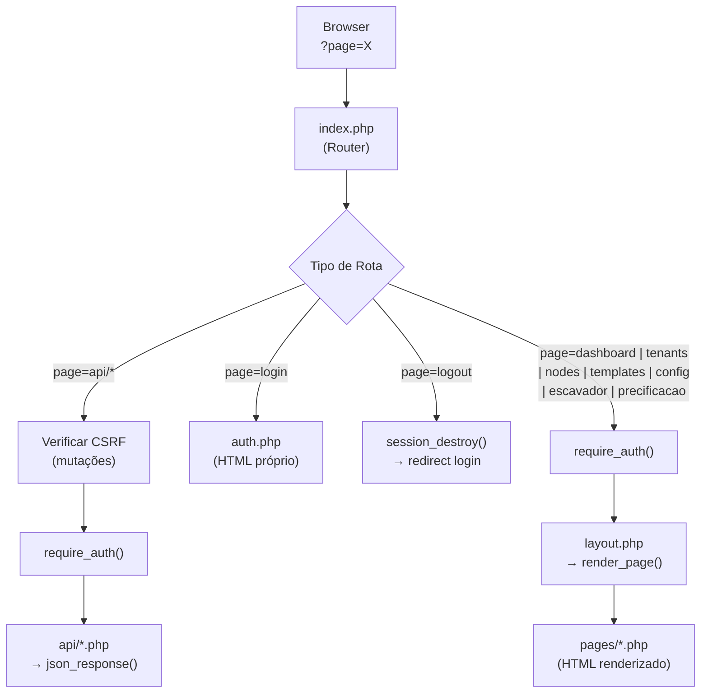

# 🚀 MotherShip Panel - Documento de Arquitetura (v1.6 - SaaS Central Management)

## 1. Visão Geral
Este documento descreve a estrutura da aplicação **MotherShip Panel**, um painel administrativo PHP puro para gerenciamento Multi-Tenant do ecossistema LawFirm SaaS.

**Status:** Documentado via leitura direta do código-fonte (Abr/2026).
**Referência de Banco:** Ver `ARCHITECTURE_mothership_db.md`.

---

## 2. Estrutura Raiz de Domínios e Pastas (`mothership/`)

A estrutura do painel segue um modelo centralizado (Single Entry Point) com separação clara entre a UI e a API JSON.

```text
mothership/
├── api/                # Endpoints JSON (autenticados, CSRF-protected)
├── assets/             # Assets estáticos (CSS global)
├── includes/           # Camada de Dados e Helpers (DB, Functions, Layout)
├── migrations/         # Scripts SQL para atualização de banco estrutural
├── pages/              # Views (Páginas renderizadas dentro do layout)
├── index.php           # 🚪 Single Entry Point — Roteador principal
├── config.php          # ⚙️ Constantes globais (DB, Auth, App)
└── auth.php            # 🔒 Página independente de login
```

---

## 3. Regras de Ouro (Development Standards)

### 3.1 Segurança e Mutação de Dados
⛔ **PROIBIDO:** Processar mutações (`POST/PUT/DELETE`) sem o token de proteção.
✅ **OBRIGATÓRIO:** Todo request que altera estado (Endpoints em `api/`) exige `require_auth()` + verificação do **CSRF Token** (Header `X-CSRF-TOKEN` ou input `_csrf`).
*   **Motivo:** Evitar ataques Cross-Site Request Forgery no painel administrador global.

### 3.2 Single Entry Point (index.php)
Todas as requisições, sejam de páginas ou APIs, passam pelo `index.php`. O roteador decide se o request é para a UI (`layout.php` + `pages/{nome}.php`) ou para um Endpoint JSON (`api/{nome}.php`).

### 3.3 Acesso a Arquivos (Vanilla JS / CSS)
O Painel não utiliza frameworks externos de Frontend (nenhum Vue, Alpine ou Bootstrap).
✅ **Padrão Frontend:** Vanilla JS (via objeto global `MS`) e CSS Puro (`style.css`), preservando leveza. O Design usa Dark Mode estrito com glassmorfismo.

---

## 4. Gráfico de Roteamento e Fluxo (Request Lifecycle)



---

## 5. Detalhamento de Rotas e URLs (Endpoints de UI)

Para manter total coerência com o padrão de mapeamento do CRM (LawFirm), apresentamos a taxonomia das URLs do Front-End servidas diretamente via `index.php?page=`:

| Domínio (Lógico) | Query URL Front-End | Descrição da Tela / Arquivo PHP |
| :--- | :--- | :--- |
| **Visão Geral** | `?page=dashboard` | **Dashboard Global:** Consolida os Tenants, Subscriptions e exibição da Foreign Key `asaas_node_id` com ações por Modal (`pages/dashboard.php`). |
| **Clientes** | `?page=clients` | **Dados Cadastrais:** Lista e edita informações financeiras (`tenant_billing_infos`) vinculadas a cada Tenant. Suporte a **PJ** (company_name, cnpj) e **PF** (cpf). Exibe contagem de infoprodutos adquiridos (`pages/clients.php`). |
| **Tenants** | `?page=tenants` | **Gestão de Inquilinos:** Tabela listando inquilinos. Deleção em Cascata inclui **DROP DATABASE** físico do banco MySQL do tenant (`pages/tenants.php`). |
| **Infraestrutura** | `?page=nodes` | **Nós (Nodes):** CRUD dos servidores compartilhados, como Evolution, MinIO, N8N, Escavador, Asaas e **Kiwify** (`pages/nodes.php`). |
| **Inteligência Art.** | `?page=templates` | **Assistentes de IA:** Registra prompts mestre globais e aciona injeção de Webhooks para invalidar caches remotos do Redis no Krayin (`pages/templates.php`). |
| **Infoprodutos** | `?page=infoprodutos` | **Plataformas Externas:** Gestão de integrações com Kiwify (e futuras plataformas). Exibe compras vinculadas a tenants e permite sincronização via API REST (`pages/infoprodutos.php`). |
| **Configurações** | `?page=config` | **Setup Master:** Painel de controle das variáveis (`app_config`), atuando como um `.env` centralizado (`pages/config.php`). |
| **Escavador Tarifas** | `?page=escavador` | **Pricing Bulk:** Interface de *Mass Update* para dezenas de tarifas de repasse (Asaas/Financeiro) do Escavador V1 e V2 (`pages/escavador.php`). |
| **Precificação e Taxas** | `?page=precificacao` | **Painel de Cobrança:** Define a Taxa de Processamento VPS (%) para LLMs e o Markup de Repasse (%) para o Escavador. Exibe a cotação USD/BRL em tempo real via PTAX/BCB com fallback automático para o último dia útil. Serve como referência para o n8n calcular os débitos de créditos dos tenants (`pages/precificacao.php`). |

> [!WARNING]
> **Ações de Interface Exclusivas:** Diferentemente do LawFirm (que renderiza rotas autônomas via Vue/Blade), O MotherShip trabalha com Modais Interativos sobrepostos via Vanilla JS. Mutacões ocorrem via `MS.ajax('POST', ...)` interceptando o DOM nativo.

---

## 6. API Endpoints (Serviços JSON)
Rotas de dados exclusivas na hierarquia `api/`.

| Arquivo (`api/X.php`) | Método | Ação (`?action=`) | Resumo da Responsabilidade |
| :--- | :--- | :--- | :--- |
| `clients.php` | GET/POST | `get`, `update` | Leitura e UPSERT dos dados fiscais em `tenant_billing_infos`. Suporta campos PJ (`company_name`, `cnpj`) e PF (`cpf`). Preenche automaticamente a coluna legada `cpf_cnpj`. |
| `tenants.php` | GET | `get` | Detalhes do tenant com JOIN em subscriptions. |
| `tenants.php` | POST | `update` | Update via **Whitelist** (`asaas_node_id`, `n8n_node_id`, `name`, etc). |
| `tenants.php` | POST | `delete` | Hard Delete em cascata **+ `DROP DATABASE IF EXISTS \`{tenant_id}\``** no MySQL. |
| `nodes.php` | POST | `create`, `update`, `delete` | Mutação de nós de Infra com Json Encode via `meta_data` field. Tipos: `n8n`, `evolution`, `minio`, `escavador`, `asaas`, `kiwify`. |
| `templates.php` | POST | `create`, `update`, `toggle` | Altera prompt/estrutura JSON e pinga/invalida CRM Caches. |
| `config.php` | POST | `update` | Atualiza o `value` de uma `key` singular na tabela `app_config`. |
| `escavador.php` | POST | `mass_update` | Atualização transacional em larga escala de precificação dinâmica `escavador_price_%`. |
| `infoprodutos.php` | GET | `platforms` | Lista os nós Kiwify cadastrados em `infrastructure_nodes`. |
| `infoprodutos.php` | GET | `purchases` | Lista compras em `infoproduct_purchases` com filtros de tenant e plataforma. |
| `infoprodutos.php` | POST | `save_platform` | Salva credenciais OAuth/Token no `meta_data` do nó Kiwify. |
| `infoprodutos.php` | POST | `sync` | Sincroniza vendas da API Kiwify com tenants locais via match de email/cpf. |
| `precificacao.php` | GET | `get_rate` | Chama `ExchangeRateService::getUsdToBrlRate()`. Retorna cotação PTAX de venda USD→BRL com data de referência e origem (`bcb` \| `cache`). |
| `precificacao.php` | POST | `save_fees` | Persiste `pricing_llm_vps_fee_percentage` e `pricing_escavador_markup_percentage` na `app_config`. |
| `exchange_rate.php` | GET | *(sem action)* | **Endpoint de Referência para o n8n.** Retorna JSON consolidado com cotação, taxas e fórmulas de cálculo prontas para uso em nós HTTP Request. **Ignora controle de sessão e requer Header `X-Api-Key`.** |

---

## 7. Services (Camada de Lógica)

### `ExchangeRateService` (`includes/ExchangeRateService.php`) — *Adicionado Abr/2026*
Service PHP puro (sem framework) responsável por obter e cachear a cotação de venda USD→BRL da API PTAX do Banco Central do Brasil.

**Método principal:** `ExchangeRateService::getUsdToBrlRate(): array`

**Auto-Atualização e Lógica de Fallback (Smart Cache):**
O serviço é projetado para operar **sem CRON jobs**, usando atualização "on-demand" (no momento em que o n8n ou o painel consultam a tarifa):
1. **Verificação Rápida:** Verifica se o cache é válido para *hoje* (ou última sexta, no caso de fins de semana). Se sim, retorna instantaneamente.
2. **Atualização Lazy:** Se o cache for obsoleto, resolve a melhor data para hoje (recuando se for fds).
3. **Consulta Dinâmica:** Chama a API BCB para a data resolvida. Se vier **vazio** (feriado ou dia sem cotação), retrocede **1 dia útil** por vez (pulando fds) até achar dados, num limite máximo de **10 tentativas**.
4. **Resiliência Extrema:** Se a API do BCB falhar totalmente por timeout da rede, retorna o valor de cache desatualizado (`stale-cache`) para impedir que os processos críticos do n8n quebrem.

**Local do Cache:** Persiste na `app_config` (chaves `pricing_usd_brl_rate_cache` e `pricing_usd_brl_rate_date`).

**Endpoint BCB:** `https://olinda.bcb.gov.br/olinda/servico/PTAX/versao/v1/odata/CotacaoDolarDia(dataCotacao=@dataCotacao)?@dataCotacao='{MM-DD-YYYY}'&$top=1&$format=json&$select=cotacaoVenda`

---

## 8. Histórico de Atualizações (Changelog)

### v1.6 — Abr/2026 (Integração de Rastreio de Custos IA no n8n)
*   **Telemetria de Custos Reais:** O ecossistema agora suporta um protocolo passivo onde o valor calculado usando a `ExchangeRateService` (via `api/exchange_rate.php`) é repassado ao n8n. O n8n processa a requisição do LLM, calcula o custo final exato, e devolve no final do webhook de reposta o payload JSON com metadados detalhados (ex: `execution_id`, `model`, `total_cost`, `real_cost`). O aplicativo Módulo de IA (LawFirm Assistant) consome esse JSON para salvar com precisão centesimal os custos locais do Tenant.

### v1.5 — Abr/2026 (Módulo Precificação e Taxas + ExchangeRateService)
*   **Novo Menu `?page=precificacao`:** Painel dedicado para configurar taxas de cobrança dos serviços LLM e Escavador. UI com cards de câmbio, simuladores ao vivo e payload JSON de referência para o n8n.
*   **Taxa LLM VPS (`pricing_llm_vps_fee_percentage`):** Percentual adicionado ao custo bruto do LLM (convertido de USD para BRL pela PTAX). Persistido em `app_config`.
*   **Markup Escavador (`pricing_escavador_markup_percentage`):** Percentual de repasse aplicado sobre o preço de tabela do Escavador. Persistido em `app_config`.
*   **`ExchangeRateService`:** Novo Service PHP puro (`includes/ExchangeRateService.php`) com busca da cotação PTAX/BCB, fallback automático para feriados/fins de semana (retrocede até 10 dias úteis) e cache em `app_config`.
*   **`api/exchange_rate.php`:** Endpoint GET de referência para o n8n. Retorna cotação + taxas + fórmulas + exemplos calculados em JSON.
*   **`migrations/add_pricing_settings.sql`:** Seed das 4 chaves `pricing_*` na `app_config`.

### v1.4 — Abr/2026 (Infoprodutos, Perfil PJ/PF, Drop Database)
*   **Módulo Infoprodutos (Kiwify):** Novo menu `?page=infoprodutos` com sincronização de compras via API REST Kiwify (`pages/infoprodutos.php` + `api/infoprodutos.php`). Matches de vendas com Tenants por email/cpf.
*   **Nó Kiwify na Infraestrutura:** Adicionado `type = 'kiwify'` ao seletor de nós em `pages/nodes.php`. Credenciais OAuth e Token Bearer estático armazenados em `meta_data` JSON do nó.
*   **Autenticação Kiwify Flexível:** Sistema suporta OAuth 2.0 dinâmico (Client Credentials) com cache de 96h **ou** Token Bearer fixo (prioritário, ignora o fluxo OAuth se presente).
*   **Clientes PJ/PF:** Tabela `tenant_billing_infos` recebeu 3 novas colunas: `company_name`, `cpf`, `cnpj`. O modal de edição em `pages/clients.php` agora exibe campos distintos para Razão Social, CPF e CNPJ.
*   **Fix Collation:** Todas as queries de JOIN entre `infoproduct_purchases` e `tenants` usam `COLLATE utf8mb4_unicode_ci` explícito para compatibilidade entre ambientes Local e VPS.
*   **Drop Database no Delete:** Ação de exclusão de tenant (`api/tenants.php?action=delete`) agora executa `DROP DATABASE IF EXISTS \`{id}\`` antes do hard delete nas tabelas do mothership. ID sanitizado via Regex para prevenir SQL Injection.

### v1.3 — Mar/2026 (Integração Gateway Asaas)
*   **Asaas Node:** Adicionado suporte nativo ao gerenciamento de Gateway de Pagamentos Asaas na infraestrutura (`pages/nodes.php`).
*   **Foreign Keys no Dashboard:** O MVC e JSON do Dashboard agora inclui comboboxes dedicadas (com Badge Âmbar 💳) para atrelar a Foreign Key `asaas_node_id` aos tenants ativos.
*   **Trava de Segurança:** Impossibilitada Deleção de Node de Infra tipo Asaas se referenciado.

### v1.2 — Mar/2026
*   **Gestão Zero .env e Dynamic Pricing (Escavador):** Implementação absoluta das páginas e API de controle da `app_config`, eliminando arquivos `.env` para provisionamento centralizado.
*   **Injeção de Cache Sync:** Webhooks ativados no `templates.php` para invalidação proativa no Laravel (LawFirm).
*   **Resiliência JSON:** `ob_start()` e exception handlers adicionados no entrypoint `index.php` interceptam outputs sujos (HTML Bleed) transformando-os em respostas HTTP 500 strict JSON.

### v1.1 — Mar/2026
*   **API Nodes (Verificação de Integridade):** Deleções requerem que o tenant seja desvinculado dos endpoints.
*   **Client-Side JS Filters:** `filterTemplates()` sem recarga para área, categoria e tracking global.
*   **Slugs e Badges Globais:** Diferenciação visual entre tenants específicos e templates master da suite.

### v1.0 — Fev/2026
*   **Lançamento Sub-Alpha:** Construção inicial, PDO Layer Helper tipado e UX/UI inspirada no Krayin LawFirm Dash System, operante sob MVC PHP Standard Native sem FW de front.

---
*Gerado pela auditoria de mapeamento em Abril/2026 — atualizado v1.5 (Precificação e Taxas).*
