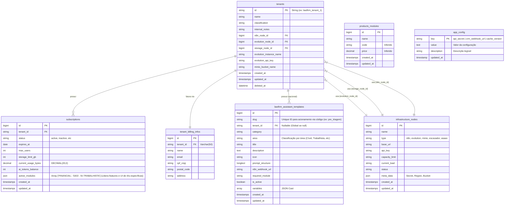

# Mothership Database Architecture (SaaS)

Este documento descreve a estrutura do banco de dados externo `mothership`, responsável pelo gerenciamento Multi-Tenant da aplicação LawFirm.

**Status:** Schema inferido via Engenharia Reversa do pacote `SuiteZap\LawFirm` (Mar/2026 - v3.17 SaaS Compliance).

## Visão Geral

O banco de dados `mothership` é segregado do banco de dados da aplicação (`mysql`). Ele armazena informações globais de infraestrutura, cobrança e configuração de tenants.

*   **Conexão Laravel:** `protected $connection = 'mothership';`
*   **Service Principal:** `SuiteZap\LawFirm\SaaS\Services\MotherShipService`

## Diagrama ER (Inferido)

## Dicionário de Dados

### 1. Tenants (`tenants`)
Armazena a identidade do cliente SaaS e suas conexões de infraestrutura.
*   **PK:** `id` (String). Não é auto-incremento.
*   **Relacionamentos:**
    *   `subscription`: HasOne.
    *   `evolutionNode`, `storageNode`, `n8nNode`: BelongsTo `infrastructure_nodes`.

### 2. Subscriptions (`subscriptions`)
Controla o plano, limites e consumo do cliente.
*   **Armazenamento:** `current_usage_bytes` é `DECIMAL(20,0)` para suportar tamanhos exatos de storage.
*   **Módulos (`active_modules`):** Array JSON que ativa features globais no frontend (ex: `FINANCIAL`, `GED`). Também atua como a chave principal de filtragem de Assistentes de IA: apenas templates (`lawfirm_assistant_templates`) cujo `required_module` esteja listado aqui são exibidos aos usuários daquele Tenant.

### 3. Infrastructure Nodes (`infrastructure_nodes`)
Catálogo de recursos compartilhados (Servidores de API, Buckets S3).
*   **Types:**
    *   `n8n`: Servidores de automação.
    *   `evolution`: Servidores de WhatsApp API.
    *   `minio`: Buckets S3/MinIO para armazenamento de arquivos.
    *   `escavador`: Integração com API Escavador V1/V2 (Tokens via `api_key`).
    *   `asaas`: Integração com o Gateway de Pagamentos (Tokens e ambiente lidos dinamicamente de `api_key` e `meta_data`).
*   **Meta Data:** Armazena segredos específicos (Secret Key do S3, Region) em JSON.

### 4. Assistant Templates (`lawfirm_assistant_templates`)
Modelos de prompt para a IA.
*   **Escopo:** Se `tenant_id` for NULL, o template é **Global** (visível para todos). Caso contrário, é exclusivo do tenant.
*   **Integração:** Pode disparar webhooks do N8N (`n8n_webhook_url`).
*   **Relação Cross-Database (Histórico):** A tabela de histórico de execuções (`lawfirm_assistant_history`) reside no **banco de dados do Tenant** (pois contém os dados sensíveis gerados e vinculações ao `lead_id`), mas mantém uma chave estrangeira lógica (`template_id`) apontando para esta tabela no Mothership. Consultas como o `AssistantHistoryDataGrid` realizam o *mapping* (via Eloquent no backend) para obter o nome do template sem fazer um JOIN SQL cross-database direto.

### 5. App Config (`app_config`) — *Adicionada em Mar/2026*
Configurações globais do ecossistema SaaS. Elimina dependência de `.env` por stack e permite precificação dinâmica.

| Chave | Valor | Descrição |
|---|---|---|
| `api_secret` | `164b104d...` (64-char hex) | Chave compartilhada entre Mothership Panel e LawFirm CRM. Autenticação de webhooks. |
| `crm_webhook_url` | URL do LawFirm | Endpoint chamado pelo Mothership Panel após mutações de template para invalidar cache. |

### 6. Tenant Billing Infos (`tenant_billing_infos`) — *Adicionada em Mar/2026*
Isola os dados sensíveis e de faturamento do assinante, permitindo que a camada Global emita cobranças (Asaas/Stripe) sem depender de tabelas internas do projeto `mysql` do Krayin (como `core_config`).
*   **PK:** `id` (BigInt).
*   **FK:** `tenant_id` aponta para `tenants.id`.
*   **Finalidade:** Armazena CNPJ/CPF, Razão Social, Email Financeiro e Endereço Completo (CEP, Bairro, Cidade, etc.). Estes dados alimentam nativamente o payload de `customerData` ao gerar novos Checkouts no Gateway Asaas.
| `cache_version` | Integer | Versão global de cache. Incrementada a cada publicação de template. |
| `escavador_price_capa` | `3.00` | Capa do Processo (V2 CNJ) |
| `escavador_price_diario` | `3.00` | PDF Diário Oficial (V2) |
| `escavador_price_busca` | `3.00` | Busca por Termo (V1) |
| `escavador_price_resumo` | `0.08` | Resumo IA por Processo (V2 IA) |
| `escavador_price_documentos_publicos` | `0.06` | Docs. Públicos de Processo (V2) |
| `escavador_price_envolvidos_processo` | `0.05` | Envolvidos de Processo (V2) |
| `escavador_price_movimentacoes_processo` | `3.00` | Movimentações de Processo (V2) |
| `escavador_price_resumo_advogado_oab` | `3.00` | Resumo de Advogado por OAB (V2) |
| `escavador_price_resumo_envolvido` | `3.00` | Resumo de Envolvido (V2) |
| `escavador_price_processos_envolvido_cpf` | `3.00` | Processos de Envolvido por CPF (V2 Async) |
| `escavador_price_atualizacao_processo_docs` | `0.75` | Atualização Processo alguns docs (V2) |
| `escavador_price_atualizacao_processo_autos` | `1.50` | Atualização Processo (baixar autos) (V2) |
| `escavador_price_atualizacao_processo_pub` | `0.20` | Atualização Processo (docs públicos) (V2) |
| `escavador_price_pagina_diario` | `3.00` | Página do Diário (V1) |
| `escavador_price_pessoas_instituicao` | `3.00` | Pessoas de Instituição (V1) |
| `escavador_price_processos_instituicao` | `3.00` | Processos de Instituição (V1) |
| `escavador_price_doc_juris` | `3.00` | Documento Jurisprudência (V1) |
| `escavador_price_pdf_juris` | `3.00` | PDF Jurisprudência (V1) |
| `escavador_price_busca_legis` | `3.00` | Busca Legislação (V1) |
| `escavador_price_doc_legis` | `3.00` | Documento Legislação (V1) |
| `escavador_price_frag_legis` | `3.00` | Fragmentos Legislação (V1) |
| `escavador_price_detalhes_pessoa` | `3.00` | Detalhes de Pessoa (V1) |
| `escavador_price_processos_pessoa` | `3.00` | Processos de Pessoa (V1) |
| `escavador_price_autos_docs_esp` | `0.75` | Autos Docs. Específicos (V1) |
| `escavador_price_proc_diario` | `3.00` | Processo Diário Oficial (V1) |
| `escavador_price_busca_proc_diario_oab` | `3.00` | Busca Procs. Diário por OAB (V1) |
| `escavador_price_busca_proc_diario_num` | `3.00` | Busca Procs. Diário por Número (V1) |
| `escavador_price_envolvidos_proc_diario` | `3.00` | Envolvidos Proc. Diário (V1) |
| `escavador_price_mov_proc_diario` | `3.00` | Movimentos Proc. Diário (V1) |
| `escavador_price_mov_processo_diario` | `3.00` | Movimentações Diário (V1) |
| `escavador_price_busca_juris` | `3.00` | Busca de Jurisprudências (V1) |
| `escavador_price_busca_diario` | `3.00` | Busca em Diários Oficiais (V1) |
| `escavador_price_info_inst` | `3.00` | Informações de Instituição (V1) |
| `escavador_price_info_pessoa` | `3.00` | Informações de Pessoa (V1) |
| `escavador_price_busca_oab` | `3.00` | Busca por OAB (V1) |
| `escavador_price_atualizar_processo` | `3.00` | Atualização de Dados de Processo (V2 Async) |
| `escavador_price_baixar_autos` | `0.18` | Baixar Autos de um Processo (V2 Async) |

*   **Sem `.env`:** Ambas as plataformas leem desta tabela. Mudança em 1 lugar propaga para todo o ecossistema.
*   **LawFirm:** `DB::connection('mothership')->table('app_config')->where('key', '...')->value('value')`
*   **Mothership Panel (Gestão via UI):** A interface administrativa permite manipular essas variáveis sem script ou comando SQL. Custos gerais na aba **Configurações** (`pages/config.php` interligada à `api/config.php`) e tarifas dinâmicas na aba **Escavador** (`pages/escavador.php` via `api/escavador.php?action=mass_update`). Reflexão instantânea usando queries próprias nativas como `db_row("SELECT value FROM app_config WHERE key='...'")`.

### 6. WhatsApp Templates Config (`lawfirm.whatsapp_templates.messages`) — *Adicionado em Mar/2026*
Com a implementação de integração entre o módulo Escavador e a Evolution API para monitoramentos, foi documentada a escalabilidade dos alertas multi-tenant.
*   **Módulo Escavador (`WebhookController`)**: Recupera ativamente o template formatado de ID `escavador_monitoramento_update` usando a key `lawfirm.whatsapp_templates.messages.escavador_monitoramento_update` atrelada ao `tenant_id` específico na tabela local e preenche com variáveis de contexto (`{termo_monitorado}`, `{fonte}`). A estrutura base da EvolutionService (instância, api_key, url) também é puxada de `infrastructure_nodes` (MotherShip).

## Notas de Implementação

1.  **Storage Dinâmico:** O Laravel não tem o disco `s3` configurado no `.env` para produção. Ele é injetado em tempo de execução (`config(['filesystems.disks.s3' => ...])`) pelo `MotherShipService::configureTenantStorage()`, usando dados de `infrastructure_nodes`.
2.  **Redirects:** URLs de `evolution_api` e `n8n` são recuperadas dinamicamente para evitar hardcoding de servidores.
3.  **Zero .env para Integração:** O `api_secret` (autenticação entre Mothership Panel e LawFirm) é lido de `app_config`, não do `.env`. O `MothershipTemplateController` usa `DB::connection('mothership')->table('app_config')` com cache de 5 min no PHP Session.
4.  **Invalidação de Cache:** Após qualquer mutação em `api/templates.php` (update/toggle/create), o Mothership Panel chama `POST {crm_webhook_url}` com `X-Mothership-Key`. O LawFirm incrementa `ai_templates_cache_version`, tornando obsoletas as keys `ai_templates:{tenantId}:{hash}:v{old}`.

---

## Interface de Armazenamento Multi-Tenant (v3.17)

Todo acesso a arquivos no pacote **deve** ser feito exclusivamente via `SuiteZap\LawFirm\SaaS\Services\SaasFileService`. O disco correto (S3/MinIO do tenant) é resolvido internamente pelo `MotherShipService::configureTenantStorage()`.

> [!IMPORTANT]
> **PROIBIDO:** `Storage::put()`, `Storage::get()`, `Storage::exists()`, `Storage::mimeType()`, `Storage::makeDirectory()` em qualquer Controller, Service ou Listener fora de `SaasFileService` e `SaasStorageService`.

| Método | Assinatura | Descrição |
|---|---|---|
| `store` | `store(UploadedFile $file, string $path): string` | Upload de arquivo via `UploadedFile` |
| `storeRaw` | `storeRaw(string $path, string $contents): bool` | Upload de conteúdo bruto (PDF gerado, JSON, etc.) — *adicionado v3.17* |
| `get` | `get(string $path): ?string` | Lê conteúdo bruto de arquivo — *adicionado v3.17* |
| `exists` | `exists(string $path): bool` | Verifica existência no disco do tenant |
| `delete` | `delete(string $path): bool` | Remove arquivo |
| `deleteDirectory` | `deleteDirectory(string $path): bool` | Remove diretório recursivo |
| `url` | `url(string $path): string` | URL pública/signed do arquivo |
| `mimeType` | `mimeType(string $path): ?string` | MIME type do arquivo — *adicionado v3.17* |
| `isAvailable` | `isAvailable(): bool` | Verifica conectividade com o disco |
